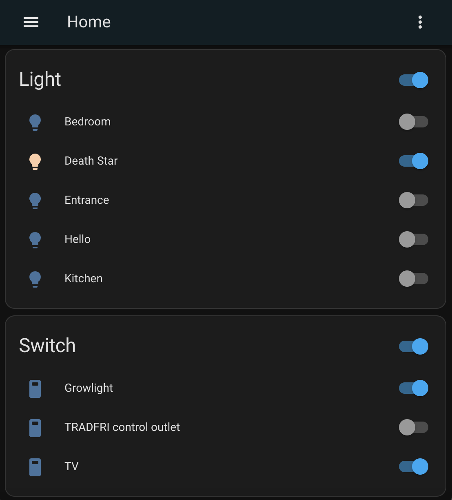

# Dirigera Client API

Unofficial client API for IKEA's new Smarthome Hub
[DIRIGERA](https://github.com/wjtje/DIRIGERA). The client API
uses DIRIGERA's REST interface at port 8443. The vast majority
of interfaces have been implemented. However, most are
barely tested, and some are known as inoperable.

## What is known to work
* Pair API with DIRIGERA
* Dump DIRIGERA's data model
* Fetch and edit devices, i.e.:
  * Gateway
    * DIRIGERA Hub for smart products
  * Repeater
    * TRADFRI signal repeater
  * Light & Driver
    * STOFTMOLN ceiling/wall lamp WW24
    * TRADFRI bulb E27 CWS 806lm
    * TRADFRI bulb E27 CWS opal 600lm
    * TRADFRI bulb E27 WS globe opal 1055lm
    * TRADFRI bulb E27 WS opal 980lm
    * TRADFRI bulb T120 E27 WS opal 470lm
    * TRADFRI bulb E14 WS opal 400lm
    * TRADFRI bulb GU10 WS 400lm
    * TRADFRI Driver 10W
    * TRADFRI Driver 30W
  * Light-Controller
    * Remote Control N2
    * TRADFRI on/off switch
    * TRADFRI remote control
  * Sound-Controller 
    * SYMFONISK Sound Controller
  * Blinds-Controller
    * TRADFRI open/close remote
  * Motion-Sensor 
    * TRADFRI motion sensor
  * Shortcut-Controller
    * TRADFRI SHORTCUT Button
  * Outlet
    * ASKVADER on/off switch
    * TRADFRI control outlet
    * Aqara Smart Plug (lumi.plug.maeu01)
  * Air Purifier
    * STARKVIND Air purifier
  * Blinds
    * PRAKTLYSING cellular blind
* Check for firmware updates
* (Un-)Link devices (e.g., light controller with light bulb)
* List music playlists and favorites
* Create, manipulate, and delete rooms
* Create, manipulate, and delete device-sets
* Create, manipulate, and delete scenes (without actions and triggers)
* Manipulate, and delete users

### Example Code
The package `dirigera-client-examples` provides several example 
applications, which essentially cover the aforementioned points.
However, to give you a glimpse of the look and feel of the library, 
here's an example:
```java
@SpringBootApplication
@ComponentScan(basePackageClasses = {DirigeraClientApi.class})
public class MyApplication {
    @Bean
    public CommandLineRunner run(final DirigeraApi api) {
        return (String... args) -> {
          api.pairIfRequired().block(); // pair gateway if required

          api.device.light.all() // fetch all light devices from hub
                  .flatMapMany(Flux::fromIterable)
                  .flatMap(d -> api.device.light.turnOn(d)) // turn on lights
                  .flatMap(d -> api.device.light.setLevel(d, 100)) // turn on lights
                  .flatMap(d -> api.device.light.setTemperature(d, d.attributes.state.color.temperatureMax)) // set color temperature
                  .blockLast();
        };
    }

    public static void main(String[] args) {
        SpringApplication.run(MyApplication.class, args).close();
    }
}
```

## What does not work

* Everything which is not defined in API's Data-Model.
  * The API's data model is strictly typed, but there are still many 
    devices missing. Hence, it's very likely you have a device linked 
    to your gateway, which is not depicted by the API. In this case, the 
    JSON deserialization will likely fail as soon as one of the endpoints
    returns the respective device data.
  * You may help us to overcome this limitation by providing us your 
    Gateway-Dump (see [How to contribute](#how-to-contribute)).
* Scene actions and triggers.

### How to contribute

The most significant pain point is the limitation of the API data model. 
You can help us to improve it, and to support progressively more devices.

To do so, run the [Dump Application](dirigera-client-dump/src/main/java/de/dvdgeisler/iot/dirigera/client/dump/DumpApplication.java). 
This application reads the data model of your DIRIGERA and outputs it as JSON. Based on the dump, 
we can determine at which points the API data model deviates or is 
incomplete. You may submit the generated dump as an issue to GitHub.

#### Build and run the Dump Application
```bash
./mvnw package
java -jar ./dirigera-client-dump/target/dirigera-client-dump-0.0.1-SNAPSHOT.jar --dirigera.hostname=<DIRIGERA-IP-ADDRESS>
```

## Integration to Home Assistant

Lights and sockets can be integrated into Home Assistant via MQTT (more devices will follow).
Home Assistant will create entities for supported devices, based on its MQTT auto discovery approach.

Add https://github.com/TheMrBooyah/hassio-repository to your home assistant.
Update the configuration to your setup.

In order to get your 'Token', run the [Dump Application](dirigera-client-dump/src/main/java/de/dvdgeisler/iot/dirigera/client/dump/DumpApplication.java). This will ask you to pair your gateway. After successfully pairing the gateway a file 'dirigera_access_token' will be created. Open the file with your favourite text editor and copy everything into the 'Token' field.

Start the addon, watch the logs for any errors and if everything went as expected, home assistant should have some new devices/entities from your IKEA Smart Hub.




## Other repos to dig in

* [wjtje/DIRIGERA](https://github.com/wjtje/DIRIGERA)
* [mattias73andersson/dirigera-client-poc](https://github.com/mattias73andersson/dirigera-client-poc)
